# Creating a Pipeline

For this section, we will be using TapisUI to create our workflow resources.\
This UI can be found at the following URL: [https://training.tapis.io/tapis-ui/#/](https://training.tapis.io/tapis-ui/#/)

---

## Step 1: Log In and Explore

Click the `Proceed to login` link on the home page, fill out the login form with your TACC credentials(username and password), and click `Log In`

In the left sidebar of the Dashboard page, you will see tabs to pages where you will find listings of the Tapis resources your created in the previous steps. Take some time to expore the Systems and Apps section by clicking on their respective tabs.

## Step 2: Create a Group

In order to create your first `Pipeline`, you must first belong to a `Group`

`Groups` are collections of users that own workflow resources. The user creating the group will be added to the user list by default with `owner` and has total control over all resources owned by it. 

Additional users can be added to the group with either basic or administrative permissions. Basic users can create their own pipelines, tasks, archives, etc, and run the other pipelines in the group. Administrators can delete pipelines owned by other users but cannot delete the group.

### How to Create a Group

Click the `Workflows` tab to navigate to the Workflows page. This is the dashboard where you can access all of your workflow resources. On this page, click the add group button in the toolbar below the workflows navbar.

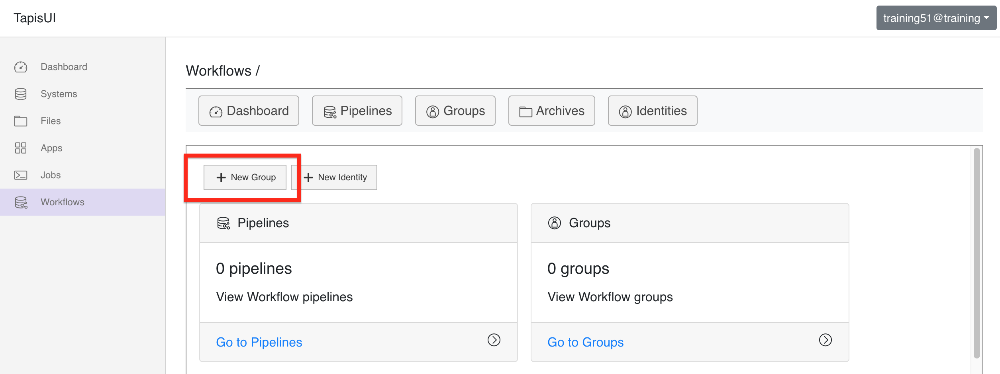

---

A modal will pop up with the form to create your group. Give the group a unique id and click the `Create Group` button at the bottom. Once you have successfully created it, exit out of the modal by click the `X` at the top.

NOTE: For this demonstration, we do not need to add any additional users to the group.

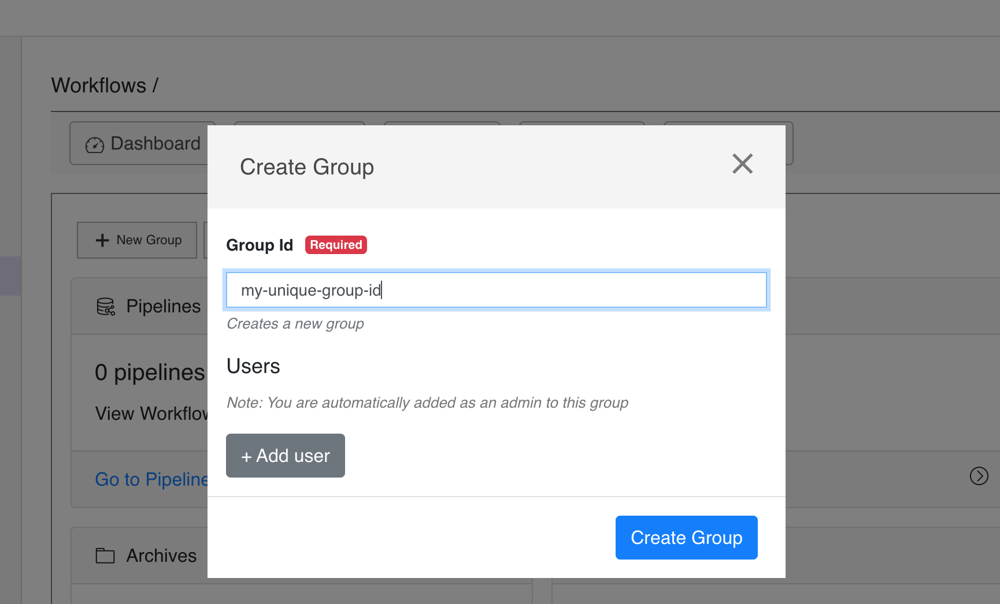

Now that you have a group, it's time to create a `Pipeline`.

---

## Step 3: Create a Pipeline

`Pipelines` are collections of tasks and a set of rules that govern how those tasks are to be executed.

To create your first pipeline, click the `Pipelines` button at the top of the workflows dashboard. This will take you to a page with a listing of all the groups you belong to.

Select the group that you just created. This will display a list of all the pipelines that belong to this group(none as of yet) as well as a button to create a pipeline. Click the `+ New Pipeline` button.

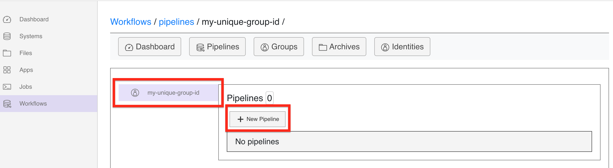

Fill out the form. Once complete, click the `Create Pipeline` button at the bottom right. Once created, exit out of the modal back to the pipelines page.

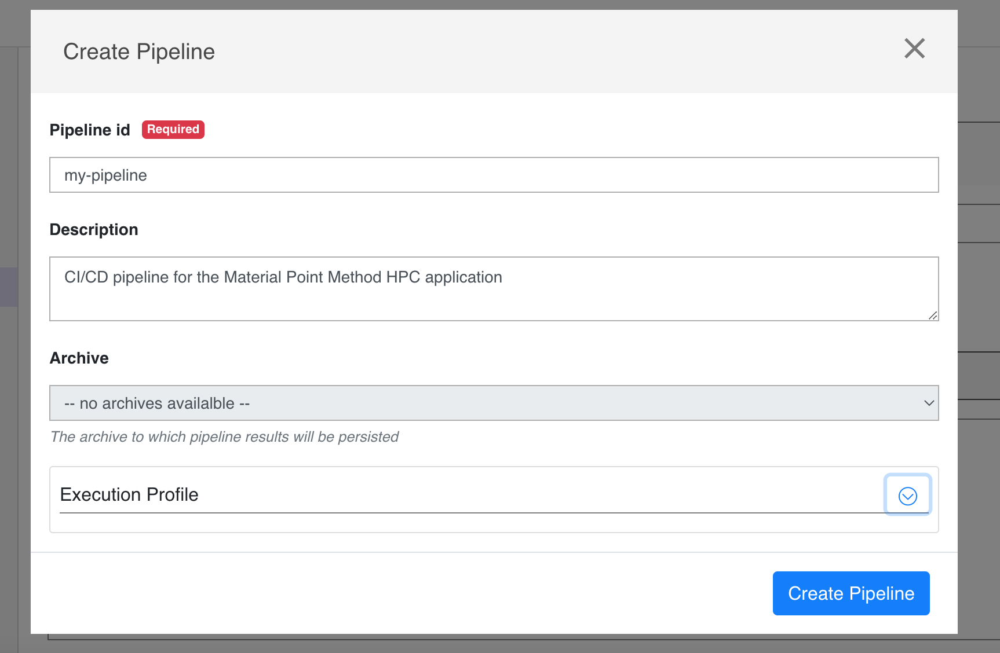

You should now see the pipeline you created. It's now time to create the first `Task` for the pipeline.

---

## Step 4: Add an 'image_build' Task to the Pipeline

The next step is to use an `image_build` task to pull the Material Point Method application code from a Github, build an image from the Dockerfile, and push it to your personal Dockerhub repository.

NOTE: This next step will require that you have an account on [dockerhub](https://https://hub.docker.com/). You will also need to create an `access token` with push permissions.

### How to create your first task

From the `Pipelines` page, click the edit button on the pipeline that you just created. This will take you to the details page for that pipeline.

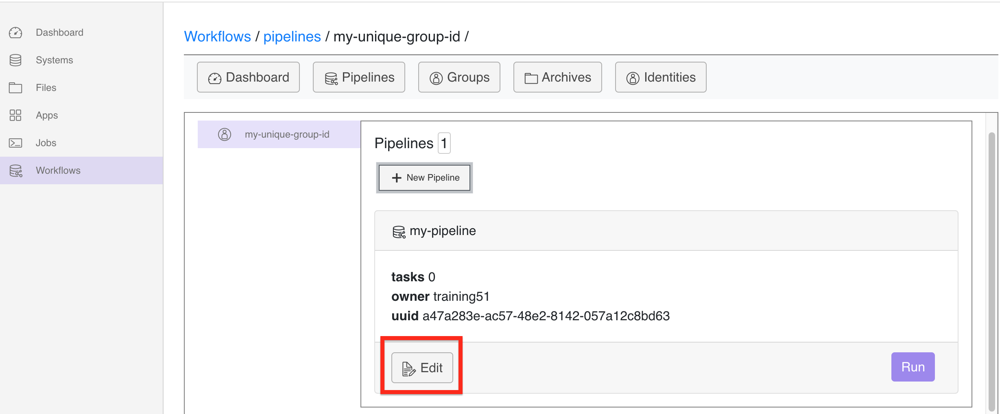

On this page, click the `+ New Task` button, this will generate a modal with a dropdown containing task types

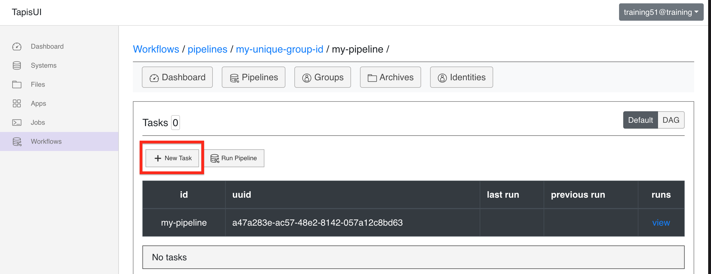

Choose the `image_build` option and click the `Next >` button

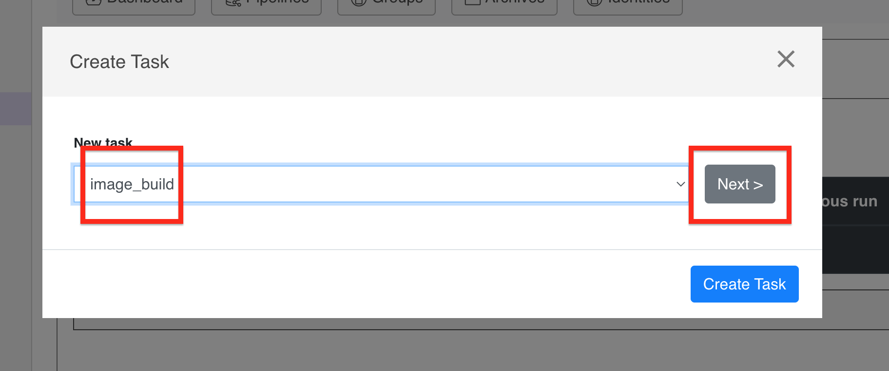

Fill out the `task id` and `description` fields. Then for the builder dropdown, select the `kaniko` option. Kaniko is a containerized image builder that allows you to create OCI compliant images from within a container without Docker

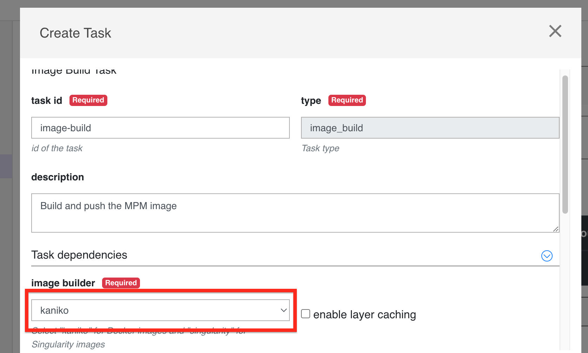

The next step is to set up the image build `context` aka the source of the image build. Once finished, the context contain all of the data needed to access and pull the MPM source from Github.

First, select `github` option from the `source` dropdown. This will generate some new fields. Fill them out with the exact values below:\
* `url` `joestubbs/mpm-container`
* `branch` `master`
* `build file path` `Dockerfile`
8 `sub path` LEAVE EMPTY!

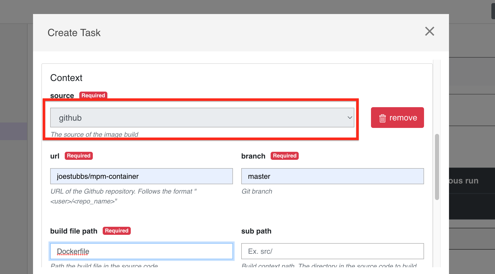

---

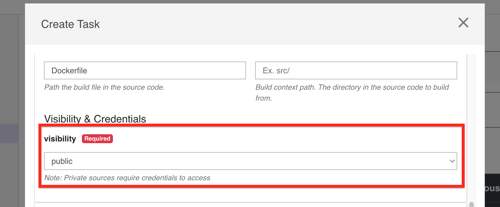

---

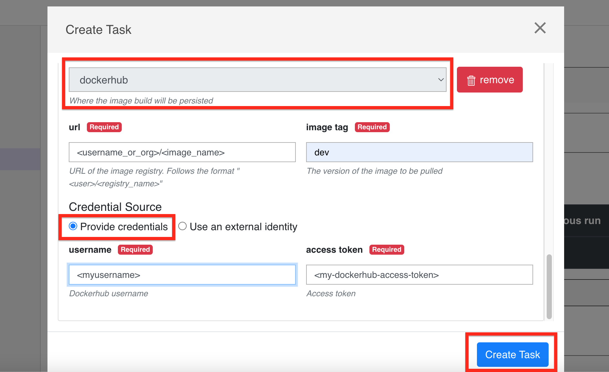

