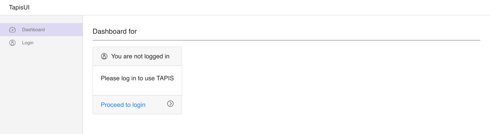
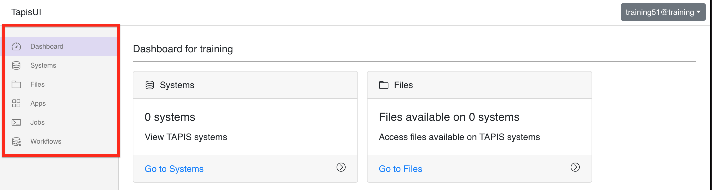

# Creating a Pipeline
---

For this section, we will be using TapisUI to create our workflow resources.
This UI can be found at the following URL: https://training.tapis.io/tapis-ui/#/

### Step 1: Log In and Explore

Click the `Proceed to login` link on the home page, fill out the login form with your TACC credentials(username and password), and click `Log In`

In the left sidebar of the Dashboard page, you will see tabs to pages where you will find listings of the Tapis resources your created in the previous steps. Take some time to expore the Systems and Apps section by clicking on their respective tabs.

### Step 2: Navigate to the Workflows Page

Now click the `Workflows` tab to navigate to the Workflows page. On this page, click the add group button in the toolbar below the workflows navbar.

